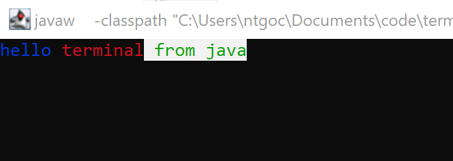
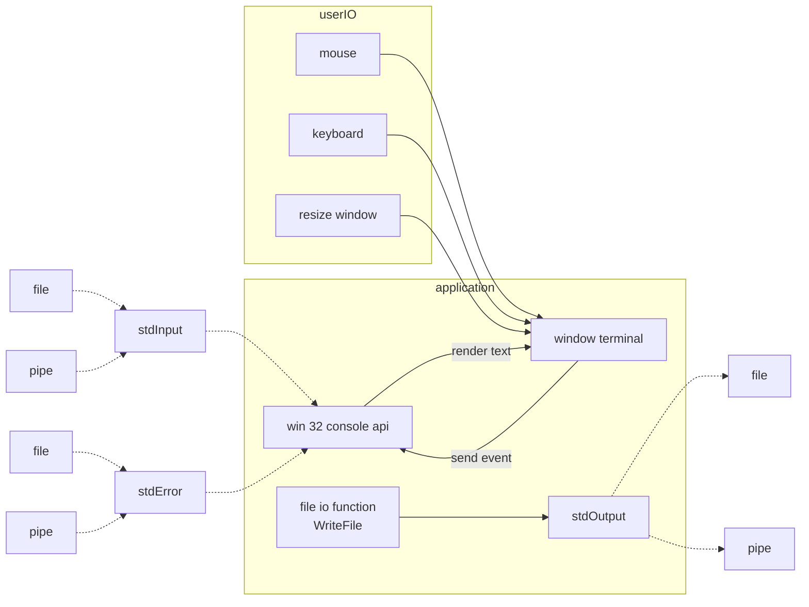
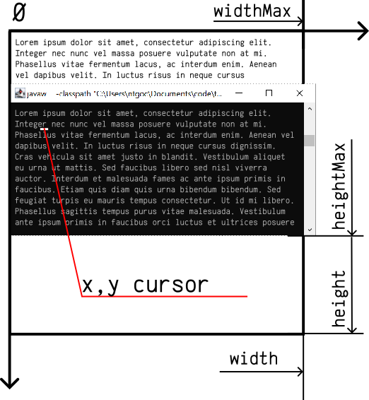

term-win
======================

term-win - это библиотека для работы с терминалом 
[windows](https://docs.microsoft.com/en-us/windows/console/using-the-high-level-input-and-output-functions), 
под капотом использует библиотеку [jna](https://github.com/java-native-access/jna).

Запуск консольного приложения
==============================

Что бы использовать данный класс, java приложение следует запустить с использованием `javaw.exe`.
В обычном использовании `java.exe` консольнуые функции не доступны по причине архитекуры ОС.

При первом создании экземпляра `xyz.cofe.term.win.WinConsole`, 
будет создана консоль `WinConsoleRawAPI#AllocConsole()`

Когда JVM будет завершать работу (`Runtime.getRuntime().addShutdownHook`), 
консоль будет освобождена `WinConsoleRawAPI#FreeConsole()`

Стандартные каналы ввода-вывода
====================================

С консолью связаны обычно 3 стандарных канала

 * stdOutputHandle : WinNT.HANDLE  - std output, канал вывода обычной информации в файл/терминал
 * stdErrorHandle  : WinNT.HANDLE  - std errput, канал вывода ошибок информации в файл/терминал
 * stdInputHandle  : WinNT.HANDLE  - std input,  канал ввода из файла/клавиатуры/....

см 

 - [rawAPI().GetStdHandle(WinConsoleRawAPI.STD_OUTPUT_HANDLE)](https://learn.microsoft.com/en-us/windows/console/getstdhandle) 

API / Программный интерфейс
==============================

Пример - вывода текста



```java
import xyz.cofe.term.win.*
    
// Создание консоли
con = new WinConsole();

// Устанавливает где будет расположен курсор
con.cursor(0,0);

// Устанавливает цвет выводимых символов
con.setCharAttributes(
  con.getCharAttributes().fgBlue(true).fgRed(false).fgGreen(false)
);

// вывод текста
con.write("hello");

con.setCharAttributes(
  con.getCharAttributes().fgBlue(false).fgRed(true).fgGreen(false)
);

con.output.write(" terminal");

con.setCharAttributes(
  con.getCharAttributes()
    .fgBlue(false).fgRed(false).fgGreen(true)
    .bgBlue(true).bgGreen(true).bgRed(true).bgIntensity(true)
);
con.errput.write(" from java");
```

Модель
-------------------



- Окно window terminal на уровне win 32 api не различает render для std output и std error
- Курсор где выводиться текст - общий для std output / std error

Скроллинг окна
------------------------

    WinConsole {
      ScreenBufferInfo getScreenBufferInfo()
      ...
    }

    ScreenBufferInfo {
      int getXCursor()
      int getYCursor()
      int getWidth()
      int getHeight()
      int getWidthMax()
      int getHeightMax()
      ...
    }



Чтение данных
---------------------

```java
console.input.read().forEach( event -> {
  if( event instanceOf InputKeyEvent ){
    // .... key board event
  }else if( event instanceOf InputMouseEvent ){
    // ....
  }else if( event instanceOf InputWindowEvent ){
    // ....
  }
});
```

